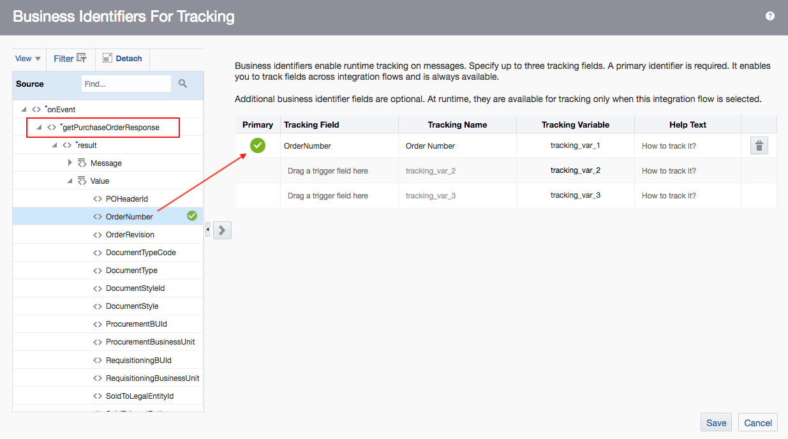
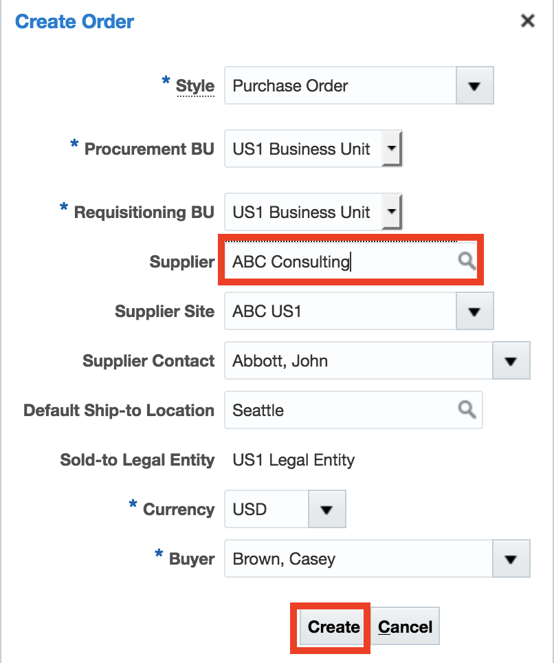

# ERP TO ATP INTEGRATION DOCUMENTATION


## OBJECTIVE

This document outlines a step-by-step guide on how to integrate ERP and ATP in Oracle Integration Cloud (OIC).
The purpose of the integration is to create a purchase order in ERP, hash the purchase order details, and send the actual purchase order details along with the hashed values to ATP. 


## COMPONENTS COVERED

* How to create and configure ERP and ATP connections in OIC
* How to generate a CSF key in SOA Composer
* How to create an integration
* Assign variables
* Map attributes between ERP and ATP
* How to register a custom script in OIC Libraries 
* How to call a custom script as a function in OIC integration orchestration 
* How to activate and monitor integration
* How to test integration using SQLDeveloper


## TOOLS & APPLICATIONS USED

* Oracle Integration Cloud 
* ERP Application
* SQLDeveloper Version 18.4.0.376


## 1.1: CREATE AN ERP CONNECTION 

#### 1.1.1: Log into the Oracle Integration Cloud platform <br/>


#### 1.1.2: Click on Integrations from the left side menu <br/>
<br/>

#### 1.1.3: Click on Connections from the left side menu <br/>
<br/>

#### 1.1.4: Click on Create from the top right corner <br/>
<br/>

#### 1.1.5: Search "Oracle ERP Cloud" in the Create Connection - Select Adapter dialogue box, and click select <br/>
<br/>

#### 1.1.6: Enter a connection name, select Trigger and Invoke for Role, and click create <br/>
<br/>

#### 1.1.7: Click on Configure Connectivity <br/>
<br/>

#### 1.1.8: Provide the ERP Services Catalog WSDL URL, and the ERP Events Catalog URL, and click OK <br/>
<br/>

#### 1.1.9: Click on Configure Security <br/>
<br/>

#### 1.1.10: Enter ERP credentials, and click OK <br/>
  <br/>

#### 1.1.11: Click on Test <br/>
 <br/>

#### 1.1.12: Make sure the test is successful and shows 100%; click Save, and close. <br/>

Note: Make sure you save first before closing. <br/>
 <br/>

#### 1.1.13: You'll see your ERP adapter appear under the list of connections <br/>
 <br/>
<br/>
***
<br/>

## 1.2: CREATE AN ATP CONNECTION 

#### 1.2.1: Click on Create from the top right corner <br/>
 <br/>

#### 1.2.2: Search "Oracle ATP" in the Create Connection - Select Adapter dialogue box, and click select <br/>
<br/>

#### 1.2.3: Enter a connection name, select Invoke for Role, and click create <br/>
<br/>

#### 1.2.4: Click on Configure Connectivity <br/>
 <br/>

#### 1.2.5: Enter Service Name, and click ok <br/>
 <br/>

#### 1.2.6: Click on Configure Security <br/>
 <br/>

#### 1.2.7: Upload wallet, provide wallet information, and click OK <br/>
 <br/>

#### 1.2.8: Click on Test <br/>
 <br/>

#### 1.2.9: Make sure the test is successful and shows 100%; click Save, and close. <br/>

Note: Make sure you save first before closing. <br/>
 <br/>

#### 1.2.10: You'll see your ATP adapter appear under the list of connections <br/>
 <br/>
<br/>
***
<br/>


## 1.3: GENERATE A CSF KEY on SOA COMPOSER

If you haven't done so before, you must create a CSF key to subscribe to events in Oracle ERP Cloud. This key is required by the event handler framework when it invokes the integration. The credentials of the integration are managed by the CSF key. Create the CSF key in Oracle SOA Composer. <br/>

NOTE: The Oracle Integration Cloud Service user must exist in Oracle Integration Cloud Service and have been assigned the IntegrationServiceRuntime role. The CSF key entry in the Oracle ERP Cloud infrastructure stores the Oracle Integration Cloud Service credentials used by Oracle ERP Cloud. When Oracle Fusion Applications send outbound requests to Oracle Integration Cloud Service (at runtime), it sends the credentials (username and password) of this account for authentication. 

Complete Documentation of how to generate a CSF key can be found [here](https://docs.oracle.com/en/cloud/paas/integration-cloud-service/icser/prerequisites-creating-connection.html#GUID-C179F26D-7409-43D7-B87B-E508A1DF7314).


#### 1.3.1: To access SOA Composer, take your ERP domain name and append '/soa/composer' to it. Open in browser <br/>
 <br/>

#### 1.3.2: Log in using your ERP credentials <br/>
 <br/>

#### 1.3.3: Click on Manage Security in the top right corner <br/>
 <br/>

#### 1.3.4: Provide the csf-key <br/>
NOTE: The CSF key = OIC Identity domain name / OIC service instance name <br/>

#### 1.3.5: The OIC identity domain name and the OIC service instance name can both be found in OIC. In OIC, click on the person icon in the top corner of the OIC page, and select About <br/>
 <br/>

#### 1.3.6: Copy and paste the domain name and service instance name into SOA Composer <br/>
 <br/>


#### 1.3.7: This is how the csf-key should look in SOA Composer <br/>
 <br/>

#### 1.3.8: Enter the Oracle Integration Cloud Service user account with which you log in to Oracle Integration Cloud (not the user name created when you subscribed to Oracle ERP Cloud). Click Register <br/>
 <br/>

#### 1.3.9: Make sure the csf-key is successfully registered <br/>
 <br/>
<br/>
***
<br/>

## 1.4: CREATE AN INTEGRATION

#### 1.4.1: In the OIC page, click on Integrations from the left side menu <br/>
 <br/>

#### 1.4.2: Click on Create from the top right corner <br/>
 <br/>

#### 1.4.3: Select App Driven Orchestration <br/>
 <br/>

#### 1.4.4: Provide integration name, and description (optional), and click Create <br/>
 <br/>

#### 1.4.5: Provide integration name, and description (optional), and click Create <br/>
 <br/>

#### 1.4.6: Click on the blue plus sign under start and search for the ERP adapter you created <br/>
 <br/>

#### 1.4.7: Provide endpoint name under Basic Info, and click Next <br/>
 <br/>

#### 1.4.8: Select With Business Events for configuration request<br/>
 <br/>

#### 1.4.9: In the Filter by Event Name field under Business Event For Subscription, search Purchase Order Event and select it <br/>
 <br/>

#### 1.4.10: In the Filter Expr for Purchase Order Event field, provide a condition that will run your integration when your purchase order's item description is a specific string. In this example, it is Doc <br/>

Copy and paste the script below in the Filter Expr for Purchase Order Event field and click Next <br/>

``` javascript 
<xpathExpr xmlns:ns0="http://xmlns.oracle.com/apps/prc/po/editDocument/purchaseOrderServiceV2/"           xmlns:ns2="http://xmlns.oracle.com/apps/prc/po/editDocument/purchaseOrderServiceV2/types/">$eventPayload/ns2:result/ns0:Value/ns0:PurchaseOrderLine/ns0:ItemDescription="Doc"</xpathExpr>
```
<br/>

 <br/>


#### 1.4.11: Select None in the response section, and click Next <br/>
 <br/>

#### 1.4.12: Click on Done in the Summary section <br/>
 <br/>

#### 1.4.13: SAVE <br/>
 <br/>
<br/>
***
<br/>

#### 1.5: Hover on the grey line below the ERP adapter and click on the blue plus sign. Search you ATP adapter and click on it.<br/>
 <br/>

#### 1.5.1: Configure the ATP adapter's Basic Info as follows, and click Next <br/>
 <br/>

#### 1.5.2: Select your table Schema, and click Search <br/>
 <br/>

#### 1.5.3: Move your table to the Selected field and click Import Tables. Click Next <br/>
 <br/>

#### 1.5.4: Choose a primary key for your table and click OK <br/>
 <br/>

#### 1.5.5: Click Next <br/>
 <br/>

#### 1.5.6: Click Done <br/>
 <br/>

#### 1.5.7: SAVE <br/>
 <br/>
<br/>
***
<br/>

#### 1.6: Click on the flag icon to the right of the page, and select the Assign action under Data <br/>
 <br/>

#### 1.6.1: Drag and drop the Assign Action right below the ERP adapter <br/>
 <br/>

#### 1.6.2: Provide action name and click Create <br/>
 <br/>

#### 1.6.3: Click on the plus sign in the right corner <br/>
 <br/>

#### 1.6.4: Provide a variable name, and click on the pencil icon under value <br/>
 <br/>

#### 1.6.5: Expand the getPurchaseOrderResponse field, and drag and drop the OrderNumber value to the Expression field <br/>
 <br/>

#### 1.6.6: Click Validate, and close <br/>
 <br/>

#### 1.6.7: Validate again, and close <br/>
 <br/>
  
#### 1.6.8: SAVE <br/>
 <br/>

<br/>
***
<br/>

#### 1.7: Click on the flag sign on the right, and select Function under the call action <br/>
 <br/>

#### 1.7.1: Drag and drop the Function action below the variable action <br/>
 <br/> 

#### 1.7.2: Provide a name for the Function action, and click Create <br/>
 <br/> 

#### 1.7.3: Click on the Function icon to upload your custom script <br/>
NOTE: Make sure your custom script is registered in OIC under Libraries first. <br/>

 <br/> 

#### 1.7.4: Search for your custom script, and click select <br/>
 <br/> 

#### 1.7.5: Click on the pencil icon under Value <br/>
 <br/> 

#### 1.7.6: Drag and drop $POVariable_OrderNumber to the Expression field <br/>
 <br/> 

#### 1.7.7: Click Validate, and close <br/>
 <br/>

#### 1.7.8: Validate again, and close <br/>
 <br/>

#### 1.7.9: SAVE <br/>
 <br/>
<br/>
***
<br/>

#### 1.8: Click on the mapper GetPODetails <br/>
 <br/>

#### 1.8.2: Click on the pencil icon  <br/>
 <br/>

#### 1.8.3: Expand the Hash attribute, and map (drag and drop) output_Hash_result from the source field to hash on the target field <br/>
 <br/>

#### 1.8.4: Expand the getPurchaseOrderResponse field, and map the appropriate vales between ERP (Sources), and ATP (PurchaseOrdersCollection) <br/>
 <br/>

#### 1.8.5: Click Validate and Close  <br/>
 <br/>

#### 1.8.6: SAVE <br/>
 <br/>
<br/>
***
<br/>

#### 1.9: To get rid of the red error notification, click on the hamburger icon on the top right <br/>
 <br/>

#### 1.9.1: Choose Tracking from the options <br/>
 <br/>

#### 1.9.2: Choose a primary value to track. Drag and drop it to the Tracking Field and Save <br/>
 <br/>

#### 1.9.3: SAVE the whole integration, and click close <br/>
 <br/>

#### 1.9.4: Activate the integration by moving the activation button to the right <br/>
 <br/>

#### 1.9.5: Select Enable tracing and include payload. Click Activate.<br/>
 <br/>
<br/>
***
<br/>

#### 1.10: Create a purchase order in ERP

#### 1.10.1: Log into you ERP system <br/>
 <br/>

#### 1.10.2: Select Procurement from the top navigation menu <br/>
 <br/>

#### 1.10.3: Select Purchase Order under Procurement <br/>
 <br/>


#### 1.10.4: Click on the hamburger menu to the top right <br/>
 <br/>

#### 1.10.4: Select Create Order <br/>
 <br/>

#### 1.10.5: Provide Supplier name and click Create <br/>
 <br/>

#### 1.10.7: Provide Supplier name and click Create <br/>
 <br/>

#### 1.10.8: Scroll down the Edit Document page and click on the plus sign under Lines <br/>
 <br/>